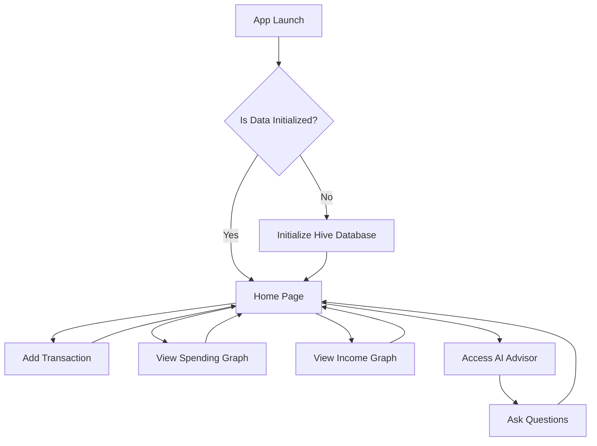
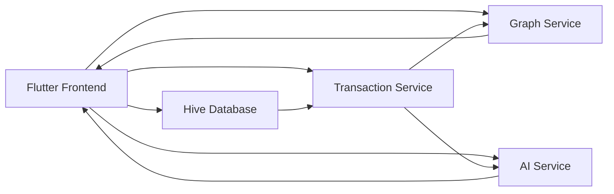

---

# Expito - Personal Expense Manager

Expito is a powerful, AI-enabled expense tracking app developed using Flutter. It provides users with a seamless way to track their income and expenses, get visual insights through graphs, and use AI to manage their finances efficiently.

## Key Features

- **Transaction Tracking**: Record and view your income and expenses effortlessly.
- **Graphical Insights**: Visualize your spending and income trends through interactive charts.
- **AI Financial Advisor**: Receive personalized recommendations on optimizing your budget.
- **Hive Local Storage**: Securely store transaction data locally using Hive, a high-performance NoSQL database.
- **Interactive UI**: A modern, responsive interface built using Flutter’s Material Design components.

## App Flow

Here is an overview of the user flow in the Expito app:



- The user begins at the **Home Page** after initializing the Hive database.
- From there, they can add transactions, view graphs, or get AI-based financial insights.
- The AI interface allows users to ask questions about their income, spending trends, and savings suggestions.

## Architecture Diagram

The following architecture diagram shows the components and flow of data within the Expito app:



### Component Breakdown:

- **Flutter Frontend**: The UI where users interact with the app. It allows transaction input, displays graphs, and interfaces with the AI assistant.
- **Hive Database**: Stores transaction data locally. Handles the data persistence for income and expenses.
- **Transaction Service**: Manages all operations related to transactions, such as adding, deleting, and fetching records.
- **Graph Service**: Processes data to generate spending and income graphs for visual insights.
- **AI Service**: Connects to Google Generative AI to provide users with tailored financial suggestions based on their data.

## Pages Overview

### 1. **Home Page**
   - Displays the total income and expenses.
   - Lists all transactions with descriptions, amounts, and dates.
   - Quick access to other app features like adding a transaction, viewing graphs, and interacting with the AI assistant.

### 2. **Graph Pages**
   - **Spending Graph**: A bar chart showing monthly expenses. Helps users understand their spending habits and identify areas to reduce costs.
   - **Income Graph**: Visualizes monthly income trends to provide clarity on income sources and amounts.

### 3. **Add Transaction Page**
   - A form where users can add income or expense transactions, providing descriptions and amounts.
   - Users can specify whether the transaction is income or expenditure, and it will be recorded accordingly in the Hive database.

### 4. **AI Assistance Page**
   - The user can ask questions like:
     - “How can I optimize my budget?”
     - “Which categories are consuming most of my spend?”
     - “What are my largest expenses this month?”
   - The AI generates personalized financial insights based on transaction data.

## Setup Instructions

### Prerequisites

- Flutter SDK installed
- Hive and its Flutter adapters installed
- API key for Google Generative AI

### Installation Steps

1. **Clone the repository**:
   ```bash
   git clone https://github.com/kaleharshavardhan07/FLUTTER_APP-EXPITO.git
   cd expito
   ```

2. **Install dependencies**:
   ```bash
   flutter pub get
   ```

3. **Set up Hive**:
   Ensure Hive is initialized, and the `transactions` box is opened in the main file.
   ```dart
   await Hive.initFlutter();
   Hive.registerAdapter(TransactionAdapter());
   await Hive.openBox<Transaction>('transactions');
   ```

4. **Set up AI API**:
   Obtain an API key from Google Generative AI and add it to the `.env` file:
   ```bash
   API_KEY=your_api_key
   ```

5. **Run the app**:
   ```bash
   flutter run
   ```

## Dependencies

- [Flutter](https://flutter.dev/)
- [Hive](https://pub.dev/packages/hive) for local storage
- [Charts Flutter](https://pub.dev/packages/charts_flutter) for visualizing income and spending trends
- [Google Generative AI](https://pub.dev/packages/google_generative_ai) for AI-driven financial suggestions
- [Flutter Markdown](https://pub.dev/packages/flutter_markdown) for displaying AI responses

<!-- ## Screenshots -->


---

## Future Enhancements

- Multi-currency support and currency conversion.
- Cloud sync options for backup and access across devices.
- Advanced AI-driven financial analytics and recommendations.

## License

This project is licensed under the MIT License - see the [LICENSE](LICENSE) file for details.

---

This version includes diagrams for both app flow and architecture, explaining the data flow and features of your app more comprehensively. You can generate the diagrams using tools like [Mermaid](https://mermaid-js.github.io/mermaid/#/) to visualize them directly in Markdown on platforms like GitHub.